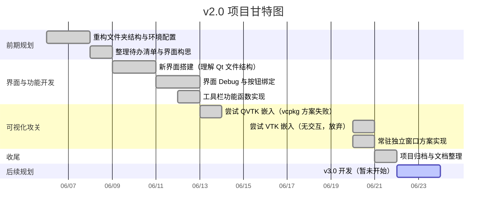

# 项目路线图

> **原则**：`[x]`=代码跑通，如果只是跑通但没有理解需要注明。

---

## 一、大阶段总览（战略里程碑）

### v1.0
- 开始日期：2026.4.21
- 完成日期：2026.5.13
- 有效时间：约30个时间段
- 大概讲解：

  - 阶段目标：从零搭建 Qt + PCL 开发环境，完成单一点云全流程处理与多幅点云配准两大核心场景，实现“无需编码、点击操作”的点云处理工具。

  - 阶段成果：完成项目功能构思、自用函数库搭建、VS+Qt Tools+PCL环境配置；完成单一点云读写、预处理、法向量估计、表面重建、可视化等核心功能；完成多幅点云批量加载、一键预处理、SAC-IA粗配准与ICP精配准、结果保存等功能；实现程序独立打包运行。

  - 踩坑与解决：Qt Creator配置PCL频繁报错，转用VS+Qt Tools解决；空指针导致程序崩溃，构造函数统一初始化解决；打包时依赖缺失，梳理依赖库、配置路径解决。

  - 成长与不足：掌握了Qt界面设计与PCL算法联动的完整开发思路；建立起模块化开发与防御性编程习惯；但多线程处理、算法底层原理、中文路径兼容等方面仍有明显不足，后续需重点补强。

  - 标志性产出：完成可独立运行的点云处理工具，支持单点云全流程处理与多幅点云配准；积累了自用PCL函数库与Qt+PCL结合开发的实践经验。

### v2.0
- 开始日期：2026.6.6
- 完成日期：2026.6.20
- 有效时间：约11个时间段
- 大概讲解：重构项目文件夹结构与环境配置，完成新界面搭建与工具栏功能开发。可视化方面，原计划 QVTK 嵌入因 VTK 无 Qt 支持无法实现，放弃该方案，改用常驻独立窗口，确保交互流畅。最终完成单点云全流程处理与多幅点云配准的完整闭环，配套文档体系同步完善，项目具备归档条件。因临近考试，暂停新功能开发，整理后准备复习。

---

## 二、当前大阶段看板：V2.0 
> 分模块列出TODO清单
### 优先级
1. 交互界面 工具栏 √
2. 可视化模块qvtk嵌入，改成常驻独立窗口 √
3. 多幅点云处理 
4. 多线程 
5. 性能检测、耗时统计
6. 各功能算法回顾与优化

### 单个点云处理
- 每个模块算法再看一遍有没有什么可以改进的。

### 多幅点云处理
- 多幅点云加载与管理  √
- 统一预处理优化  
- 多幅点云拼接

### 可视化模块
下拉列表：
- 单个（先单窗口，可切换对比，**暂不做多窗口对比**）
  - 原始点云
  - 法向量点云
  - Mesh网格模型
- 多幅
  - 原始未配准多幅点云（彩色区分？）
  - 拼接结果
  - 粗配准结果
  - 精配准结果
- 可视化操作
  - 居中显示

### 交互界面设计
- 比例缩放设计？

### 其他
- 多线程处理
- 性能检测
- 耗时统计
- 稳定性？
- 开启自动导入示例点云？
---

## 三、各大阶段甘特图
### v1.0
```Mermaid
```

### v2.0
